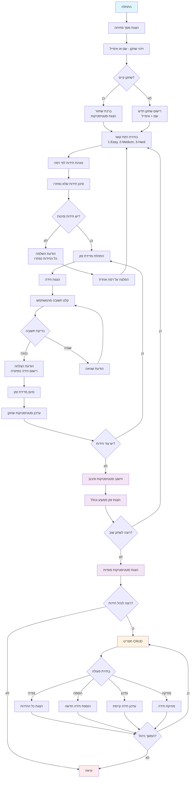

# משחק חידות מתמטי – Math Riddles Game

<p align="center">
  
  
  
</p>

---

## תיאור כללי

משחק טריוויה מתמטי אינטראקטיבי עם ממשק שורת פקודה מתקדם. המשחק כולל מערכת ניהול שחקנים, מערכת ניהול חידות מלאה (CRUD), מדידת זמנים, מעקב אחר התקדמות אישית וסטטיסטיקות מתקדמות.

### תכונות עיקריות
- 🎯 **משחק חידות מתמטי** עם שלוש רמות קושי
- 👤 **מערכת ניהול שחקנים** - זיהוי וניהול פרופילים אישיים
- 📊 **מדידת זמנים** ומעקב אחר ביצועים אישיים
- 🎮 **מעקב התקדמות** - שמירה על חידות שנפתרו עבור כל שחקן
- 🔧 **מערכת ניהול חידות מלאה** - צפייה, הוספה, עדכון ומחיקה
- 🎨 **ממשק משתמש צבעוני** עם אפקטים ויזואליים
- 💾 **שמירה קבועה** של נתונים לקבצי JSON
- 🏆 **סטטיסטיקות מתקדמות** - זמן ממוצע, זמן כולל, התקדמות לפי רמה
- 📈 **מערכת המלצות** - המלצה על רמה מתאימה לשחקן

---

## תרשים זרימה



---

## התקנה והרצה

### דרישות מערכת
- Node.js גרסה 14.0 ומעלה
- NPM או Yarn

### הוראות התקנה

```bash
# שכפול הפרויקט
git clone https://github.com/HershyRozenfeld/Riddle_Game.git

# מעבר לתיקיית הפרויקט
cd Riddle_Game

# התקנת התלויות
npm install

# יצירת תיקיית נתונים
mkdir data

# הרצת המשחק
npm start
```

או בצורה ישירה:
```bash
node app.js
```

---

## מבנה הפרויקט

```
Riddle_Game/
├── 📁 models/               # מחלקות המערכת
│   ├── ManageGame.js       # מנהל המשחק הראשי
│   ├── Player.js           # מחלקת שחקן
│   ├── RiddleManager.js    # מנהל חידות בודדות
│   └── UIManager.js        # מנהל ממשק המשתמש
├── 📁 riddles/             # מאגר החידות (Legacy)
│   ├── exportRiddles.js    # יצוא חידות ישנות
│   ├── r1.js - r4.js      # חידות בסיסיות
│   └── riddles.txt        # קובץ החידות (לא בשימוש)
├── 📁 utils/               # כלי עזר
│   ├── exportToApp.js      # יצוא מרכזי
│   ├── crudUtils.js        # פונקציות CRUD לחידות
│   ├── playersManager.js   # ניהול שחקנים
│   ├── gameUtils.js        # כלי עזר למשחק
│   ├── timeUtils.js        # חישובי זמן
│   ├── riddleStatsUtils.js # סטטיסטיקות מתקדמות
│   └── readFile.js         # קריאת קבצים (legacy)
├── 📁 data/                # תיקיית נתונים (יש ליצור)
│   ├── riddles.txt         # קובץ החידות הראשי (JSON)
│   └── players.json        # קובץ נתוני השחקנים
├── app.js                  # נקודת כניסה ראשית
├── package.json            # הגדרות הפרויקט
└── README.md              # מדריך זה
```

---

## מדריך שימוש

### זרימת המשחק הבסיסית

1. **הפעלת המשחק** - הרץ `npm start`
2. **זיהוי שחקן** - הזן שם או אימייל קיים, או הירשם כשחקן חדש
3. **בחירת רמת קושי**:
   - `1` - קל (Easy)
   - `2` - בינוני (Medium) 
   - `3` - קשה (Hard)
4. **פתרון החידות** - ענה על החידות שלא פתרת עדיין
5. **צפייה בתוצאות** - ראה את הזמן הממוצע, הכולל והתקדמות
6. **ניהול חידות** (אופציונלי) - הוסף, ערוך או מחק חידות

### מערכת ניהול השחקנים

#### זיהוי שחקן קיים
```
Enter name or email: john@example.com
Welcome back, John! 🎮
You have already solved 15 riddles
Progress by level:
  Easy: 8 riddles
  Medium: 5 riddles
  Hard: 2 riddles
```

#### רישום שחקן חדש
```
Enter name or email: jane
Couldn't find you in the system. Let's add you! 🆕
What's your name? Jane Doe
What's your email? jane@example.com
Great! You've been successfully registered, Jane Doe! 🎉
```

### מערכת ניהול החידות (CRUD)

#### 1. צפייה בחידות
```
What would you like to do: (View(1), Add(2), Update(3), Delete(4)) 1
```
מציג את כל החידות הקיימות בכל הרמות עם פרטים מלאים.

#### 2. הוספת חידה חדשה
```
What would you like to do: (View(1), Add(2), Update(3), Delete(4)) 2
```
- בחר רמת קושי (Easy/Medium/Hard)
- הזן שם לחידה
- הזן את השאלה
- הזן את התשובה הנכונה (מספר)

#### 3. עדכון חידה קיימת
```
What would you like to do: (View(1), Add(2), Update(3), Delete(4)) 3
```
- הזן ID של החידה
- עדכן את השדות הרצויים (או השאר ריק לשמירה)

#### 4. מחיקת חידה
```
What would you like to do: (View(1), Add(2), Update(3), Delete(4)) 4
```
- הזן ID של החידה
- אשר את המחיקה

---

## אדריכלות המערכת

### מחלקות עיקריות

#### `RiddleGame` - המנהל הראשי
```javascript
class RiddleGame {
    async start()              // הפעלת המשחק
    async playRound()          // סיבוב משחק יחיד
    async crudManager()        // ניהול החידות
    async selectCrudAction()   // בחירת פעולת CRUD
    askRiddles(array, level)   // הצגת חידות עם מעקב רמה
}
```

#### `Player` - מחלקת השחקן
```javascript
function Player() {
    this.identify()        // זיהוי או יצירת שחקן
    this.getPlayerData()   // קבלת נתוני שחקן
    this.showStats()       // הצגת סטטיסטיקות
    this.recordTime()      // רישום זמן (legacy)
}
```

#### `RiddleManager` - מנהל חידה בודדת
```javascript
function RiddleManager(id, name, task, answer) {
    this.askManager()          // ניהול השאלה
    this.check(answer)         // בדיקת תשובה
    this.start()              // התחלת מדידת זמן
    this.endAndCalculation()   // סיום וחישוב
}
```

#### `UIManager` - מנהל ממשק המשתמש
```javascript
class UIManager {
    showWelcome()          // הצגת מסך פתיחה צבעוני
    askPlayAgain()         // שאילת המשך משחק
}
```

### פונקציות עזר

#### Players Management (`playersManager.js`)
- `findPlayer(identifier)` - חיפוש שחקן לפי שם או אימייל
- `createPlayer(name, email)` - יצירת שחקן חדש
- `updatePlayer(player)` - עדכון נתוני שחקן
- `filterUnsolvedRiddles(riddles, player)` - סינון חידות שלא נפתרו
- `addSolvedRiddle(player, riddle, time, level)` - הוספת חידה פתורה
- `identifyOrCreatePlayer()` - זיהוי או יצירת שחקן
- `showPlayerStats(player)` - הצגת סטטיסטיקות שחקן

#### CRUD Operations (`crudUtils.js`)
- `readRiddlesFromFile()` - קריאת חידות מקובץ
- `writeRiddlesToFile(data)` - כתיבת חידות לקובץ
- `getRiddles()` - הצגת כל החידות
- `setRiddles()` - הוספת חידה חדשה
- `updateRiddle()` - עדכון חידה קיימת
- `deleteRiddle()` - מחיקת חידה
- `getRiddlesByLevel(level)` - קבלת חידות לפי רמה

#### Statistics Utilities (`riddleStatsUtils.js`)
- `getPlayerProgress(player)` - התקדמות מפורטת של שחקן
- `showDetailedProgress(player)` - הצגת התקדמות עם גרפים
- `getRecommendedLevel(player)` - המלצה על רמה מתאימה
- `calculatePlayerRank(player, allPlayers)` - חישוב דירוג שחקן

#### Time Utilities (`timeUtils.js`)
- `getSumAndAverage(array)` - חישוב סכום וממוצע
- `divMinutesAndSeconds(seconds)` - המרה לפורמט MM:SS

#### Game Utilities (`gameUtils.js`)
- `askLevel()` - שאילת רמת קושי

---

## פורמט קבצי הנתונים

### קובץ החידות (`data/riddles.txt`)
```json
{
    "Easy": [
        {
            "id": 1,
            "name": "Easy Math 1",
            "TaskDescription": "What is 45 + 4?",
            "CorrectAnswer": 49
        }
    ],
    "Medium": [...],
    "Hard": [...]
}
```

### קובץ השחקנים (`data/players.json`)
```json
{
    "players": [
        {
            "id": 1,
            "name": "John Doe",
            "email": "john@example.com",
            "solvedRiddles": [1, 2, 3],
            "stats": {
                "totalRiddles": 15,
                "totalTimeSeconds": 300,
                "averageTimeSeconds": 20,
                "levelProgress": {
                    "Easy": 8,
                    "Medium": 5,
                    "Hard": 2
                }
            },
            "lastPlayed": "2024-01-15T10:30:00.000Z"
        }
    ]
}
```

---

## דוגמת הרצה

```
  __  __       _   _       _____  _     _     _ _
 |  \/  |     | | | |     |  __ \(_)   | |   | | |
 | \  / | __ _| |_| |__   | |__) |_  __| | __| | | ___  ___
 | |\/| |/ _` | __| '_ \  |  _  /| |/ _` |/ _` | |/ _ \/ __|
 | |  | | (_| | |_| | | | | | \ \| | (_| | (_| | |  __/\__ \
 |_|  |_|\__,_|\__|_| |_| |_|  \_\_|\__,_|\__,_|_|\___||___/

🎯 Welcome to the Advanced Math Riddles Game! 🎯

=== Player Identification ===
Enter name or email: john@example.com
Welcome back, John! 🎮
You have already solved 15 riddles
Progress by level:
  Easy: 8 riddles
  Medium: 5 riddles
  Hard: 2 riddles

What level you Want? (Easy(1) Medium(2) Hard(3)): 1
3 new riddles found for you at Easy level

What is 30 + 15?: 45
Your answer is correct!

What is 50 - 12?: 38
Your answer is correct!

What is 8 * 7?: 56
Your answer is correct!

Average time per riddle: 00:12
Total time to solve riddles: 00:36

🔄 Want to play another round?
Yes (y) or No (n): n

=== Statistics for John ===
Total riddles solved: 18
Average time per riddle: 00:18
Total time: 05:24

Progress by level:
  Easy: 11 riddles
  Medium: 5 riddles
  Hard: 2 riddles

Would you like to view, add, update, or delete riddles?
Yes (y) or No (n): y

What would you like to do: (View(1), Add(2), Update(3), Delete(4)) 2

=== Add New Riddle ===
Select difficulty (Easy/Medium/Hard): Easy
Riddle name: Quick Addition
Riddle description: What is 25 + 35?
Correct answer (number): 60
New riddle added successfully to level Easy!
```

---

## תלויות

### Dependencies
```json
{
    "chalk": "^5.4.1",          // עיצוב טקסט צבעוני
    "figlet": "^1.8.1",         // כיתוב אמנותי
    "readline-sync": "^1.4.10"  // קלט סינכרוני
}
```

### Installation
```bash
npm install chalk figlet readline-sync
```

---

## תכונות מתקדמות

### מערכת ניהול שחקנים
- זיהוי שחקנים קיימים לפי שם או אימייל
- רישום שחקנים חדשים עם פרטים מלאים
- שמירה קבועה של התקדמות אישית
- מעקב אחר חידות שנפתרו למניעת חזרות

### מדידת ביצועים מתקדמת
- מדידת זמן פתרון לכל חידה
- חישוב זמן ממוצע אישי מצטבר
- הצגת זמן כולל לכל הסיבוב
- סטטיסטיקות התקדמות לפי רמה

### ממשק משתמש מתקדם
- כיתוב אמנותי עם Figlet
- צבעים עם Chalk
- מסכי ניווט ברורים
- הודעות מותאמות אישית

### מערכת המלצות חכמה
- המלצה על רמות קושי מתאימות
- הצגת התקדמות ויזואלית
- זיהוי שחקנים שסיימו רמות

---

## בעיות ידועות ופתרונות

### 🔧 בעיות שנמצאו בקוד:

1. **נתיב קבצים**: הקוד מחפש קבצים ב-`data/` אבל המבנה מציג `riddles/`
2. **Import שגוי**: ב-`exportToApp.js` יש import שגוי של `manageGame.js` במקום `ManageGame.js`
3. **תלות חסרה**: `playersManager.js` לא נמצא במבנה התיקיות

### 💡 הוראות תיקון:

1. **צור את תיקיית הנתונים**:
```bash
mkdir data
```

2. **העתק קבצים נדרשים**:
```bash
# העתק את קובץ החידות
cp riddles/riddles.txt data/riddles.txt

# צור קובץ שחקנים ריק
echo '{"players": []}' > data/players.json
```

3. **תקן את קובץ exportToApp.js**:
```javascript
// שנה את השורה:
export { RiddleGame } from "../models/manageGame.js";
// ל:
export { RiddleGame } from "../models/ManageGame.js";
```

---

## פיתוח והרחבה

### הוספת תכונות חדשות
1. **רמות קושי נוספות** - הוסף רמות ל-`gameUtils.js` ו-`data/riddles.txt`
2. **סוגי חידות חדשים** - הרחב את מערכת החידות
3. **מערכת ניקוד** - הוסף נקודות ודירוגים
4. **מצבי משחק** - הוסף מצבים מיוחדים (זמן מוגבל, אתגרים)

### התאמה אישית
- שנה צבעים ב-`UIManager.js`
- הוסף אפקטים ויזואליים
- הרחב את מערכת הסטטיסטיקות
- הוסף מערכת הישגים

---

## פתרון בעיות נפוצות

### שגיאות קבצים
```bash
Error: ENOENT: no such file or directory, open 'data/riddles.txt'
```
**פתרון**: צור את תיקיית `data` והעתק את הקבצים הנדרשים.

### שגיאות Import
```bash
Error: Cannot find module '../models/manageGame.js'
```
**פתרון**: תקן את שמות הקבצים ב-`exportToApp.js`.

### בעיות התקנה
```bash
# נקה cache
npm cache clean --force

# התקן מחדש
rm -rf node_modules package-lock.json
npm install
```

---

## Contributing

1. Fork את הפרויקט
2. צור branch חדש (`git checkout -b feature/amazing-feature`)
3. תקן את הבעיות הידועות
4. הוסף בדיקות
5. Commit השינויים (`git commit -m 'Add amazing feature'`)
6. Push ל-branch (`git push origin feature/amazing-feature`)
7. פתח Pull Request

---

## רישיון

הפרויקט מחולק תחת רישיון ISC. ראה `LICENSE` לפרטים נוספים.

---

## יוצרים

- **Hershy Rozenfeld** - *מפתח ראשי* - [GitHub](https://github.com/HershyRozenfeld)

---

## היסטוריית גרסאות

### v2.0.0 (עדכון נוכחי)
- ✨ הוספת מערכת ניהול שחקנים מלאה
- 🎮 מעקב אחר התקדמות אישית
- 🔧 מערכת CRUD מלאה לחידות
- 🚀 שדרוג לארכיטקטורה async/await
- 🎨 שיפור ממשק המשתמש עם צבעים
- 📊 הרחבת מערכת הסטטיסטיקות
- 🏆 הוספת מערכת המלצות חכמה
- 🔧 תיקוני bugs מרובים

### v1.0.0 (גרסה ראשונית)
- 🎯 משחק חידות בסיסי
- ⏱️ מדידת זמנים
- 🎨 ממשק שורת פקודה
- 📁 מערכת קבצים בסיסית

---

## תמיכה

נתקלת בבעיה? יש לך שאלות?
- פתח [Issue](https://github.com/HershyRozenfeld/Riddle_Game/issues) ב-GitHub
- שלח מייל למפתח
- בדוק את הדוקומנטציה לעיל
- עקב אחר התיקונים הנדרשים בסעיף "בעיות ידועות"

---

<p align="center">
  <strong>🎮 תהנה מהמשחק! 🎮</strong>
</p>