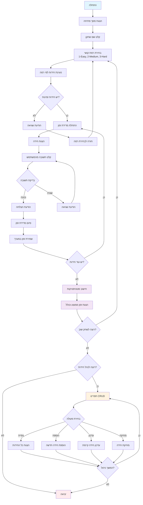

# משחק חידות מתמטי – Math Riddles Game

<p align="center">
  
  
  
</p>

---

## תיאור כללי

משחק טריוויה מתמטי אינטראקטיבי עם ממשק שורת פקודה מתקדם. המשחק כולל מערכת ניהול חידות מלאה (CRUD), מדידת זמנים, סטטיסטיקות מתקדמות וממשק משתמש צבעוני.

### תכונות עיקריות
- 🎯 **משחק חידות מתמטי** עם שלוש רמות קושי
- 📊 **מדידת זמנים** ומעקב אחר ביצועים
- 🔧 **מערכת ניהול חידות מלאה** - צפייה, הוספה, עדכון ומחיקה
- 🎨 **ממשק משתמש צבעוני** עם אפקטים ויזואליים
- 💾 **שמירה קבועה** של נתונים לקובץ JSON
- 🏆 **סטטיסטיקות מתקדמות** - זמן ממוצע, זמן כולל ועוד

---

## תרשים זרימה



---

## התקנה והרצה

### דרישות מערכת
- Node.js גרסה 14.0 ומעלה
- NPM או Yarn

### הוראות התקנה

```bash
# שכפול הפרויקט
git clone https://github.com/HershyRozenfeld/Riddle_Game.git

# מעבר לתיקיית הפרויקט
cd Riddle_Game

# התקנת התלויות
npm install

# הרצת המשחק
npm start
```

או בצורה ישירה:
```bash
node app.js
```

---

## מבנה הפרויקט

```
Riddle_Game/
├── 📁 classes/               # מחלקות המערכת
│   ├── ManageGame.js        # מנהל המשחק הראשי
│   ├── Player.js            # מחלקת שחקן
│   ├── RiddleManager.js     # מנהל חידות בודדות
│   └── UIManager.js         # מנהל ממשק המשתמש
├── 📁 riddles/              # מאגר החידות
│   ├── exportRiddles.js     # יצוא חידות ישנות (legacy)
│   ├── riddles.txt          # קובץ החידות הראשי (JSON)
│   └── r1.js - r4.js       # חידות בסיסיות (legacy)
├── 📁 utils/                # כלי עזר
│   ├── exportToApp.js       # יצוא מרכזי
│   ├── crudUtils.js         # פונקציות CRUD
│   ├── gameUtils.js         # כלי עזר למשחק
│   ├── timeUtils.js         # חישובי זמן
│   └── readFile.js          # קריאת קבצים (legacy)
├── app.js                   # נקודת כניסה ראשית
├── package.json             # הגדרות הפרויקט
└── README.md               # מדריך זה
```

---

## מדריך שימוש

### זרימת המשחק הבסיסית

1. **הפעלת המשחק** - הרץ `npm start`
2. **הכנסת שם שחקן** - הזן את שמך
3. **בחירת רמת קושי**:
   - `1` - קל (מספרים 1-20)
   - `2` - בינוני (מספרים 1-50) 
   - `3` - קשה (מספרים 1-100)
4. **פתרון החידות** - ענה על החידות המוצגות
5. **צפייה בתוצאות** - ראה את הזמן הממוצע והכולל
6. **ניהול חידות** (אופציונלי) - הוסף, ערוך או מחק חידות

### מערכת ניהול החידות (CRUD)

#### 1. צפייה בחידות
```
What do you want to do: (View(1), Add(2), Update(3), Delete(4)) 1
```
מציג את כל החידות הקיימות בכל הרמות.

#### 2. הוספת חידה חדשה
```
What do you want to do: (View(1), Add(2), Update(3), Delete(4)) 2
```
- בחר רמת קושי (Easy/Medium/Hard)
- הזן שם לחידה
- הזן את השאלה
- הזן את התשובה הנכונה

#### 3. עדכון חידה קיימת
```
What do you want to do: (View(1), Add(2), Update(3), Delete(4)) 3
```
- הזן ID של החידה
- עדכן את השדות הרצויים (או השאר ריק לשמירה)

#### 4. מחיקת חידה
```
What do you want to do: (View(1), Add(2), Update(3), Delete(4)) 4
```
- הזן ID של החידה
- אשר את המחיקה

---

## אדריכלות המערכת

### מחלקות עיקריות

#### `RiddleGame` - המנהל הראשי
```javascript
class RiddleGame {
    async start()           // הפעלת המשחק
    async playRound()       // סיבוב משחק יחיד
    async crudManager()     // ניהול החידות
    askRiddles(array)       // הצגת חידות
}
```

#### `Player` - מחלקת השחקן
```javascript
function Player() {
    this.askName()          // שאילת שם
    this.recordTime()       // רישום זמן
    this.showStats()        // הצגת סטטיסטיקות
}
```

#### `RiddleManager` - מנהל חידה בודדת
```javascript
function RiddleManager(id, name, task, answer) {
    this.askManager()       // ניהול השאלה
    this.check(answer)      // בדיקת תשובה
    this.start()           // התחלת מדידת זמן
    this.endAndCalculation() // סיום וחישוב
}
```

#### `UIManager` - מנהל ממשק המשתמש
```javascript
class UIManager {
    showWelcome()          // הצגת מסך פתיחה
    askPlayAgain()         // שאילת המשך משחק
}
```

### פונקציות עזר

#### CRUD Operations (`crudUtils.js`)
- `getRiddles()` - הצגת כל החידות
- `setRiddles()` - הוספת חידה חדשה
- `updateRiddle()` - עדכון חידה קיימת
- `deleteRiddle()` - מחיקת חידה
- `getRiddlesByLevel(level)` - קבלת חידות לפי רמה

#### Time Utilities (`timeUtils.js`)
- `getSumAndAverage(array)` - חישוב סכום וממוצע
- `divMinutesAndSeconds(seconds)` - המרה לפורמט MM:SS

#### Game Utilities (`gameUtils.js`)
- `askLevel()` - שאילת רמת קושי

---

## פורמט קובץ החידות

```json
{
    "Easy": [
        {
            "id": 1,
            "name": "Easy Math 1",
            "TaskDescription": "What is 45 + 4?",
            "CorrectAnswer": 49
        }
    ],
    "Medium": [...],
    "Hard": [...]
}
```

---

## דוגמת הרצה

```
  __  __       _   _       _____  _     _     _ _
 |  \/  |     | | | |     |  __ \(_)   | |   | | |
 | \  / | __ _| |_| |__   | |__) |_  __| | __| | | ___  ___
 | |\/| |/ _` | __| '_ \  |  _  /| |/ _` |/ _` | |/ _ \/ __|
 | |  | | (_| | |_| | | | | | \ \| | (_| | (_| | |  __/\__ \
 |_|  |_|\__,_|\__|_| |_| |_|  \_\_|\__,_|\__,_|_|\___||___/

🎯 Welcome to the Advanced Math Riddles Game! 🎯

What is your name? John
Hello John
What level you Want? (Easy(1) Medium(2) Hard(3)): 1

What is 45 + 4?: 49
Your answer is correct!

What is 10 + 7?: 17
Your answer is correct!

What is 20 - 5?: 15
Your answer is correct!

What is 6 * 3?: 18
Your answer is correct!

What is 25 / 5?: 5
Your answer is correct!

Average time taken to solve a riddle 00:08
Total time of solving riddles 00:40

🔄 Want to play another round?
Yes (y) or No (n): n

Do you want to view, add, update, or delete riddles? 
Yes (y) or No (n): y

What do you want to do: (View(1), Add(2), Update(3), Delete(4)) 1

=== כל החידות ===

--- Easy ---
ID: 1 | שם: Easy Math 1
שאלה: What is 45 + 4?
תשובה: 49
...
```

---

## תלויות

### Dependencies
```json
{
    "chalk": "^5.4.1",      // עיצוב טקסט צבעוני
    "figlet": "^1.8.1",     // כיתוב אמנותי
    "readline-sync": "^1.4.10"  // קלט סינכרוני
}
```

### Installation
```bash
npm install chalk figlet readline-sync
```

---

## תכונות מתקדמות

### מדידת ביצועים
- מדידת זמן פתרון לכל חידה
- חישוב זמן ממוצע לחידה
- הצגת זמן כולל לכל הסיבוב

### ממשק משתמש מתקדם
- כיתוב אמנותי עם Figlet
- צבעים עם Chalk
- מסכי ניווט ברורים

### אבטחת נתונים
- הכלת Validation על קלטי משתמש
- טיפול בשגיאות קבצים
- בדיקת תקינות נתונים

---

## פיתוח והרחבה

### הוספת חידות חדשות
1. דרך המשחק - השתמש במערכת CRUD
2. ידני - ערוך את `riddles/riddles.txt`

### הוספת רמות קושי
1. עדכן את `gameUtils.js`
2. הוסף רמה חדשה ל-`riddles.txt`
3. עדכן את הלוגיקה ב-`ManageGame.js`

### התאמה אישית
- שנה צבעים ב-`UIManager.js`
- הוסף אפקטים ויזואליים
- הרחב את מערכת הסטטיסטיקות

---

## פתרון בעיות נפוצות

### שגיאות קבצים
- ודא שהקובץ `riddles/riddles.txt` קיים
- בדוק הרשאות קריאה/כתיבה

### בעיות התקנה
```bash
# נקה cache
npm cache clean --force

# התקן מחדש
rm -rf node_modules package-lock.json
npm install
```

### שגיאות Runtime
- ודא שגרסת Node.js תואמת (14+)
- בדוק שכל הקבצים קיימים

---

## Contributing

1. Fork את הפרויקט
2. צור branch חדש (`git checkout -b feature/amazing-feature`)
3. Commit השינויים (`git commit -m 'Add amazing feature'`)
4. Push ל-branch (`git push origin feature/amazing-feature`)
5. פתח Pull Request

---

## רישיון

הפרויקט מחולק תחת רישיון ISC. ראה `LICENSE` לפרטים נוספים.

---

## יוצרים

- **Hershy Rozenfeld** - *מפתח ראשי* - [GitHub](https://github.com/HershyRozenfeld)

---

## היסטוריית גרסאות

### v2.0.0 (עדכון נוכחי)
- ✨ הוספת מערכת CRUD מלאה
- 🚀 שדרוג לארכיטקטורה async/await
- 🎨 שיפור ממשק המשתמש
- 📊 הרחבת מערכת הסטטיסטיקות
- 🔧 תיקוני bugs מרובים

### v1.0.0 (גרסה ראשונית)
- 🎯 משחק חידות בסיסי
- ⏱️ מדידת זמנים
- 🎨 ממשק שורת פקודה
- 📁 מערכת קבצים בסיסית

---

## תמיכה

נתקלת בבעיה? יש לך שאלות?
- פתח [Issue](https://github.com/HershyRozenfeld/Riddle_Game/issues) ב-GitHub
- שלח מייל למפתח
- בדוק את הדוקומנטציה לעיל

---

<p align="center">
  <strong>🎮 תהנה מהמשחק! 🎮</strong>
</p>
